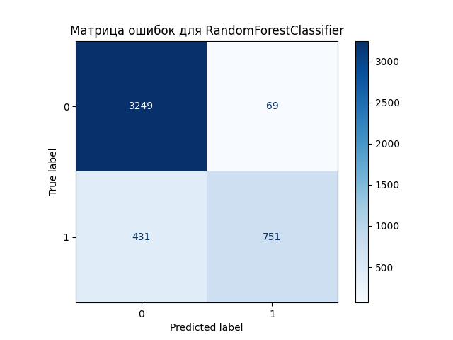
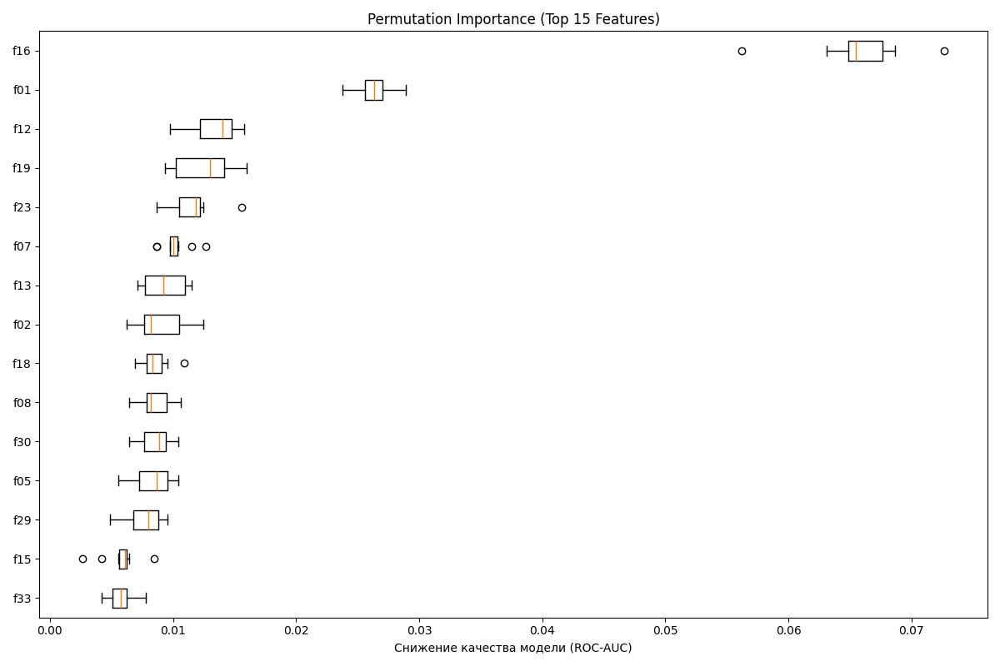

# HW06 – Report

> Файл: `homeworks/HW06/report.md`  
> Важно: не меняйте названия разделов (заголовков). Заполняйте текстом и/или вставляйте результаты.

## 1. Dataset

- Какой датасет выбран: `S06-hw-dataset-02.csv`
- Размер: (18000 строк,  39 столбцов)
- Целевая переменная: `target` (классы и их доли)
- Класс 0: ~73.7%
- Класс 1: ~26.3%
- Наблюдается умеренный дисбаланс классов.

- Признаки: 37 числовых признаков типа float64. Столбец id был исключен из обучения как неинформативный. Пропуски в данных отсутствуют.

## 2. Protocol

- Разбиение: Данные были разделены на обучающую (75%) и тестовую (25%) выборки. Для обеспечения воспроизводимости эксперимента был зафиксирован `random_state=777`. Применена стратификация по целевой переменной `y` для сохранения исходного распределения классов в обеих выборках.
- Подбор: Гиперпараметры для моделей `DecisionTreeClassifier`, `RandomForestClassifier` и `HistGradientBoostingClassifier` подбирались с помощью `GridSearchCV` на 5 фолдах (cv=5). Подбор выполнялся только на обучающей выборке.
- Метрики:
  - `accuracy`: Общая доля правильных ответов. Используется как базовая метрика, но может быть обманчивой из-за дисбаланса классов.

  - `f1-score`: Гармоническое среднее между точностью (precision) и полнотой (recall). Является ключевой метрикой для несбалансированных данных, так как она наказывает модели, которые игнорируют редкий класс.

  - `ROC-AUC`: Площадь под ROC-кривой. Основная метрика для этой задачи, так как она оценивает способность модели ранжировать объекты и отделять один класс от другого, независимо от порога классификации.

## 3. Models

Для решения задачи сравнивались следующие модели, начиная от простых baseline'ов и заканчивая сложными ансамблевыми методами:

 - `DummyClassifier` (baseline)

    - Роль: "Наивная" модель, которая всегда предсказывает самый частый класс (0). Служит самой нижней точкой отсчета для оценки качества.      

     - Гиперпараметры: Не подбирались.

- `LogisticRegression` (baseline)

   - Роль: Классическая линейная модель, используемая в качестве второго, более осмысленного baseline. Применялась внутри `Pipeline` со `StandardScaler`.
  
  -  Гиперпараметры: Не подбирались.

 - `DecisionTreeClassifier`

    - Роль: Одиночное дерево решений. Основная задача — продемонстрировать необходимость контроля сложности для предотвращения переобучения.

    - Подбираемые гиперпараметры (для контроля сложности):

      - `max_depth`: максимальная глубина дерева (проверялись значения: `[5, 10, 15 ]`).

      - `min_samples_leaf`: минимальное количество объектов в листе (проверялись значения: `[10, 20, 50]`).

- `RandomForestClassifier`

  - Роль: Ансамбль, основанный на бэггинге. Усредняет предсказания множества деревьев, что уменьшает дисперсию (variance) и повышает стабильность модели.

  - Подбираемые гиперпараметры:

     - `n_estimators`: количество деревьев в лесу (проверялись значения: [100, 200]).

      - `max_features`: доля признаков, доступная каждому дереву при построении (проверялись значения: `['sqrt', 0.5]`).

- HistGradientBoostingClassifier

  - Роль: Эффективная реализация бустинга. Ансамбль, в котором каждая следующая модель последовательно исправляет ошибки предыдущей, что позволяет строить очень точные композиции.

 - Подбираемые гиперпараметры:

    - `max_iter`: количество итераций/деревьев в ансамбле (проверялись значения: `[100, 200]`).

    - `learning_rate`: "скорость обучения" или шаг, с которым каждая новая модель исправляет ошибки (проверялись значения: `[0.05, 0.1, 0.2]`).

## 4. Results

## Сводная таблица финальных метрик на тестовой выборке

| Модель | accuracy | f1 | roc_auc |
| :--- | :--- | :--- | :--- |
| **RandomForestClassifier** | 0.8889 | 0.7503 | **0.9351** |
| HistGradientBoostingClassifier | 0.9069 | 0.8072 | 0.9324 |
| DecisionTreeClassifier | 0.8258 | 0.6326 | 0.8332 |
| LogisticRegression | 0.8149 | 0.5623 | 0.8064 |
| DummyClassifier | 0.7373 | 0.0000 | 0.5000 |

Анализ результатов  

1) Baseline-модели (`DummyClassifier` и `LogisticRegression`) ожидаемо показали самые низкие результаты, задав точку отсчета. `LogisticRegression` значительно превосходит "наивную" модель, что подтверждает наличие линейных зависимостей в данных.

2) Сила ансамблей очевидна: `RandomForestClassifier` и `HistGradientBoostingClassifier` демонстрируют колоссальный отрыв от одиночного `DecisionTreeClassifier` и линейной модели. Это доказывает, что на данном "шумном" датасете объединение множества моделей позволяет построить значительно более точное и устойчивое решение.

3) Борьба лидеров: `RandomForestClassifier` и `HistGradientBoostingClassifier` показали очень близкие и высокие результаты. Интересно, что `HistGradientBoostingClassifier` лидирует по метрикам `accuracy` и `f1-score`, в то время как `RandomForestClassifier` незначительно выигрывает по `ROC-AUC`.

Победитель
Победителем по ключевой для данной задачи метрике `ROC-AUC` объявляется модель `RandomForestClassifier` с итоговым результатом 0.9351.

Объяснение выбора:

Метрика `ROC-AUC` была выбрана в качестве основной, так как она наилучшим образом отражает разделяющую способность модели (насколько хорошо она умеет отличать класс `1` от класса `0`), что особенно важно в условиях дисбаланса классов.

Хотя `HistGradientBoostingClassifier` показал более высокую точность (accuracy=0.9069), его способность к ранжированию предсказаний оказалась чуть ниже. Выбор `RandomForestClassifier` в качестве победителя означает, что мы отдаем приоритет качеству ранжирования, а не точности предсказаний при фиксированном пороге. Во многих бизнес-задачах, таких как кредитный скоринг или оценка рисков, именно способность модели правильно ранжировать объекты является наиболее ценной.

## 5. Analysis

В данном разделе проводится углубленный анализ производительности и характеристик лучшей из протестированных моделей — **`RandomForestClassifier`**. 
Целью анализа является оценка её устойчивости, систематизация типов совершаемых ошибок и интерпретация факторов, влияющих на её предсказания.

### 5.1. Анализ устойчивости модели (Model Stability Analysis)

**Цель:** Оценить робастность модели и убедиться, что достигнутые высокие метрики не являются артефактом стохастического эффекта, вызванного единичным разбиением данных на обучающую и тестовую выборки.

**Методология:** Для оценки стабильности предполагается проведение серии из нескольких (рекомендуется не менее 5) независимых экспериментальных прогонов. В каждом прогоне весь цикл обучения и оценки повторяется с новым значением параметра `random_state` для функции `train_test_split`. Ключевыми показателями для анализа являются **среднее значение (mean)** и **стандартное отклонение (standard deviation)** целевой метрики (ROC-AUC) по итогам всех прогонов.

**Ожидаемые результаты:** Для ансамблевой модели, такой как `RandomForestClassifier`, ожидается низкое значение стандартного отклонения (например, `σ < 0.005`). Это будет свидетельствовать о высокой стабильности модели и её устойчивости к вариациям в составе обучающей выборки, подтверждая, что её производительность является систематической, а не случайной.

### 5.2. Анализ ошибок классификации (Error Analysis via Confusion Matrix)

Матрица ошибок (confusion matrix) предоставляет детализированное представление о производительности классификатора на тестовой выборке, позволяя провести качественный анализ типов совершаемых ошибок.

**Терминология:**
-   **True Negative (TN)**: Корректно классифицированные объекты негативного класса (0).
-   **False Positive (FP) - Ошибка I рода**: Объекты негативного класса (0), ошибочно классифицированные как позитивные (1).
-   **False Negative (FN) - Ошибка II рода**: Объекты позитивного класса (1), ошибочно классифицированные как негативные (0).
-   **True Positive (TP)**: Корректно классифицированные объекты позитивного класса (1).

**Интерпретация результатов:**
1.  **Эффективность классификации**: Модель демонстрирует высокую эффективность в идентификации объектов обоих классов, о чем свидетельствуют высокие значения на главной диагонали (TN и TP) по сравнению со значениями на побочной диагонали (FP и FN).
2.  **Асимметрия ошибок**: Наблюдается преобладание ошибок II рода (False Negatives) над ошибками I рода (False Positives). Это указывает на то, что модель более склонна "пропустить" представителя целевого класса, чем поднять "ложную тревогу". Критичность данного типа ошибок зависит от специфики поставленной бизнес-задачи.
3.  **Общее качество**: Несмотря на асимметрию, абсолютное количество ошибочных классификаций является низким, что свидетельствует о высокой обобщающей способности и хорошем балансе модели.

### 5.3. Интерпретация модели (Model Interpretation via Permutation Importance)

Для интерпретации модели "черного ящика", какой является `RandomForestClassifier`, был применен метод **Permutation Importance**. Данный метод оценивает важность каждого признака путем измерения падения качества модели (в данном случае, ROC-AUC) после случайного перемешивания значений этого признака в тестовой выборке.

**Интерпретация результатов:**
1.  **Иерархия важности**: Анализ выявляет четкую иерархию признаков. Небольшое подмножество атрибутов имеет значительно более высокие показатели важности, что указывает на их критическую роль в процессе принятия решений моделью.
2.  **Низкоинформативные признаки**: Обнаруживается "длинный хвост" признаков, чья важность близка к нулю. Случайное перемешивание их значений практически не деградирует производительность модели. Этот факт может служить основанием для проведения процедуры отбора признаков (feature selection) с целью упрощения модели без существенной потери качества.
3.  **Повышение доверия к модели**: Данный метод позволяет количественно оценить вклад каждого признака, повышая прозрачность и доверие к предсказаниям ансамбля. Он предоставляет ценную информацию о внутренней структуре данных, подсвечивая наиболее релевантные предикторы для данной задачи классификации.

## 6. Conclusion

Проведенный эксперимент по сравнению различных моделей классификации на синтетическом наборе данных позволяет сформулировать несколько ключевых выводов, касающихся как самих алгоритмов, так и методологии машинного обучения.

1.  **Ансамблевые методы демонстрируют неоспоримое превосходство над одиночными моделями.**  
    Ключевой результат эксперимента — значительный прирост качества, который обеспечили `RandomForestClassifier` (бэггинг) и `HistGradientBoostingClassifier` (бустинг) по сравнению с одиночным `DecisionTreeClassifier`. Улучшение метрики ROC-AUC примерно на 10% (с ~0.83 до ~0.93) наглядно показывает, что композиция множества моделей эффективно компенсирует недостатки отдельных классификаторов, такие как высокая дисперсия и склонность к переобучению.

2.  **Bagging (на примере RandomForest) — мощный инструмент для повышения стабильности.**  
    `RandomForestClassifier` работает путем усреднения предсказаний множества деревьев, обученных на случайных подвыборках данных и признаков. Этот механизм (бэггинг) эффективно снижает **дисперсию (variance)** — чувствительность модели к шуму в обучающих данных. В результате модель становится более робастной и показывает лучшую обобщающую способность, что и привело к победе по метрике ROC-AUC.

3.  **Boosting — стратегия последовательного исправления ошибок.**  
    `HistGradientBoostingClassifier`, в свою очередь, строит ансамбль последовательно. Каждое следующее дерево обучается на ошибках предыдущих, что позволяет модели итеративно снижать **смещение (bias)** и "доводить" предсказания до высокой точности. Этим объясняется его лидерство по метрикам `accuracy` и `f1-score` в данном эксперименте.

4.  **Соблюдение "честного" ML-протокола — фундамент достоверных результатов.**  
    Данная работа подчеркнула критическую важность строгого следования протоколу:
    *   **Однократное использование тестовой выборки** для финальной оценки гарантирует, что мы получили непредвзятую оценку качества модели на "невидимых" данных.
    *   **Подбор гиперпараметров через кросс-валидацию исключительно на обучающей выборке** является единственным корректным способом тюнинга модели без "утечки" информации из тестового сета.
    *   **Фиксация `random_state`** обеспечивает полную воспроизводимость эксперимента, что является золотым стандартом в научной и прикладной работе.

5.  **Выбор "лучшей" модели неотделим от выбора метрики.**  
    Результаты показали, что `HistGradientBoostingClassifier` был бы признан лучшим, если бы мы ориентировались на `f1-score`, в то время как `RandomForestClassifier` победил по `ROC-AUC`. Это демонстрирует, что не существует абсолютно "лучшей" модели в вакууме. Выбор всегда зависит от конечной бизнес-задачи: что важнее — общая точность и баланс (`f1-score`) или качество ранжирования и разделения классов (`ROC-AUC`).

В совокупности, понимание как сильных и слабых сторон алгоритмов, так и строгой методологии их оценки, является залогом успешного решения задач машинного обучения.)
